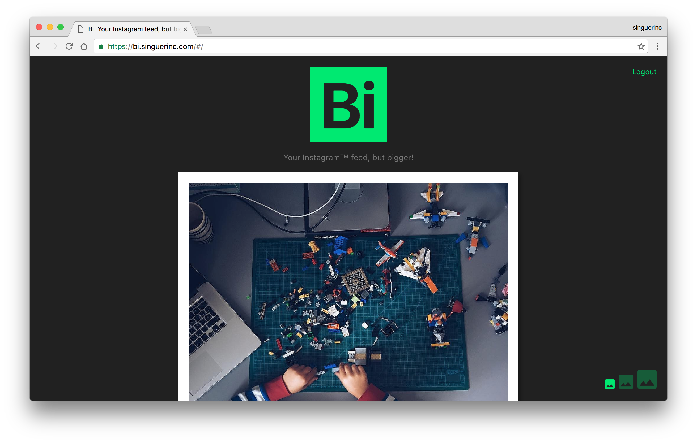

# Bi


Bi is a personal experiment. Is a website that displays images from your Instagram™, but bigger!

[https://bi.singuerinc.com](https://bi.singuerinc.com)

The idea behind it is to test technologies like Vue.js, webpack, Docker, PostCSS and yarn among others.



## Run

```bash
yarn run dev
open http://localhost:8080/
```

## Build

```bash
yarn run build
open ./public
```
